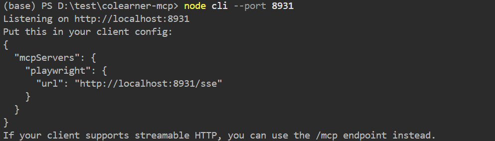
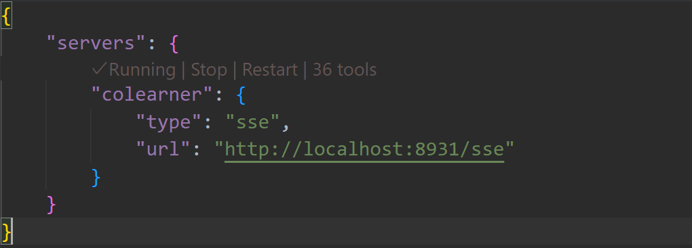

## CoLearner-MCP
**Still Under Developing.**
An Open-Source MCP Project based on Playwright-MCP.  
In an attempt to **make Web Learning and Homework Automatic**.  
For `Tsinghua University Students Only`.  


### Requirements
- An IDE / Desktop App or any other Apps supporting LLMs with MCP Server.
  - VSCode, Cursor, Claude Desktop etc.
  - If you don't have an online LLM Provider, you can apply for Github Education [https://github.com/education] for free Copilot Subscription. You can also deploy a LLM.
- Node.js 
  - For more detailed information, please refer to Playwright-MCP [https://github.com/microsoft/playwright-mcp]

## MCP Tools for Automatic Workflow

### Tools for Web Learning (网络学堂)

- browser_wlxt_login: 登录到网络学堂 (请在.env中设定好账号密码)
  - 注: 在仓库不作为LLM的Context时, LLM不会直接接触到.env中的信息
- browser_wlxt_navigate_to_course: 导航到特定的课程, 提供课程名即可
- browser_wlxt_navigate_course_file: 导航到课程文件界面
- browser_wlxt_navigate_course_homework: 导航到课程作业界面
- browser_download_wlxt_course_resource: 下载指定的课程文件(需要先导航到课程文件界面) 


### Tools for Overleaf (清华大学Overleaf)

- browser_overleaf_homepage: 导航到清华Overleaf界面 (需要预先登录, 安全起见，清华统一认证的登录没有自动化)
- browser_overleaf_create_project: 创建新的空Overleaf Project
- browser_overleaf_navigate: 导航到指定的Overleaf Project

### Resources from Web Learning (将网络学堂资料作为Resource)
TO BE CONTINUED

## Usage and Examples

### Install
```
git clone ***
cd colearner-mcp
npm install
npm run build
node cli --port 8931
```
You are supposed to see below outputs:  



### Configuration in VSCode

1. Click MCP Tools  
  

2. Add more tools - Add MCP Server - HTTP Server  

  

3. Enter URL (default: http://localhost:8931/sse)  

4. Click Workspace settings  

5. Save and click run to start  

### Example 
Prompt: 调用网络学堂工具登录到网络学堂，导航并下载概率论与随机过程的L12课件  

WorkFlow: (Please refer to ./assets/record1.mp4)
<video controls src="assets/record1.mp4" title="Title"></video>
